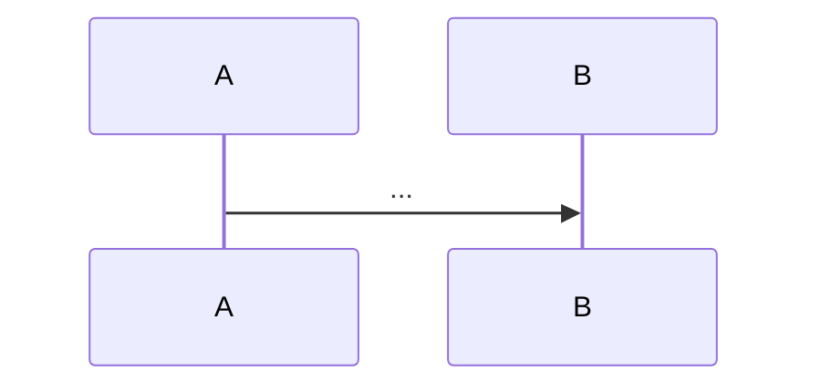
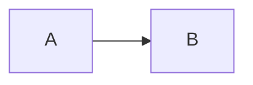

# spec-format — reference contract

Canonical on-disk schema for the three specwright artifacts: `requirements.md`, `design.md`, and `bugfix.md`. Every skill that reads or writes these files (`/specwright:to-prd`, `/specwright:slice`, `/specwright:review`, `/specwright:bugfix`) must conform to this contract.

Storage rationale: [ADR 0001 — Hybrid spec storage](../docs/adr/0001-hybrid-spec-storage.md).

---

## Where these files live

```text
.specs/<slug>/
├── requirements.md   # EARS-notation acceptance criteria + user stories
├── design.md         # architecture, mermaid diagrams, error handling, testing strategy
├── bugfix.md         # bugfix flow only
└── TASKS.md          # auto-generated mirror of beads slices — DO NOT EDIT
```

The `<slug>` matches the beads epic ID. `TASKS.md` is regenerated on slice changes; it is never a source of truth.

**Tiny flow exception:** `/specwright:tiny` writes no `.specs/` directory. The entire spec lives in a single beads issue body — see [Tiny-flow inline variant](#tiny-flow-inline-variant).

---

## EARS notation

Acceptance criteria are written in EARS (Easy Approach to Requirements Syntax). Four variants are supported:

| Variant | Pattern |
| --- | --- |
| Ubiquitous | `THE <SYSTEM> SHALL <RESPONSE>` |
| Event-driven | `WHEN <TRIGGER> THE <SYSTEM> SHALL <RESPONSE>` |
| State-driven | `WHILE <STATE> THE <SYSTEM> SHALL <RESPONSE>` |
| Optional (feature) | `WHERE <FEATURE> THE <SYSTEM> SHALL <RESPONSE>` |

Keywords (`WHEN`, `WHILE`, `WHERE`, `THE`, `SHALL`) are uppercase. The subject and response are written naturally.

**Valid examples:**

- `THE SYSTEM SHALL persist every order for at least 30 days.`
- `WHEN the customer submits a valid order THE SYSTEM SHALL return an order ID within 200 ms.`
- `WHILE the kitchen queue is full THE SYSTEM SHALL reject new orders with HTTP 503.`
- `WHERE loyalty points are enabled THE SYSTEM SHALL deduct points on order completion.`

**Invalid — do not use:**

- `When the customer submits …, the system shall …` — lowercase keywords, comma after trigger.
- `If the customer cancels then the system shall …` — `IF/THEN` is not a supported variant.

Each criterion is a single sentence, written as a markdown list item.

---

## requirements.md

```markdown
# Requirements: <slug or feature title>

## Assumptions

- [YYYY-MM-DD] Assumed X because Y.

## User Stories

- As a <role>, I want <capability> so that <benefit>.

## Acceptance Criteria

- THE SYSTEM SHALL …
- WHEN <trigger> THE SYSTEM SHALL …
- WHILE <state> THE SYSTEM SHALL …
- WHERE <feature> THE SYSTEM SHALL …
```

| Section | Required |
| --- | --- |
| H1 title | yes |
| `## Assumptions` | quick flow only; omitted for feature and bugfix flows |
| `## User Stories` | yes |
| `## Acceptance Criteria` | yes |
| Additional sections (e.g. `## Out of Scope`) | optional |

Notes:
- `## Assumptions` appears only when written by `/specwright:quick`. Each item is dated and phrased "Assumed X because Y."
- `## User Stories` and `## Acceptance Criteria` may appear in either order.
- Each acceptance criterion must be a single EARS sentence on its own list item.

---

## design.md

````markdown
# Design: <slug or feature title>

## Overview

<short prose summary of the architecture>

## Sequence



## Data Flow



## Error Handling

<how the system surfaces and recovers from failures>

## Testing Strategy

<intent-based test approach per layer>
````

| Section | Required |
| --- | --- |
| H1 title | yes |
| `## Overview` | yes |
| `## Sequence` | yes |
| `## Data Flow` | yes |
| `## Error Handling` | optional |
| `## Testing Strategy` | optional |

Notes:
- `## Overview`, `## Sequence`, and `## Data Flow` must appear in that order.
- `## Sequence` must contain a fenced `mermaid` block starting with `sequenceDiagram`.
- `## Data Flow` must contain a fenced `mermaid` block starting with `flowchart` or `graph`.
- Optional sections follow `## Data Flow` in any order.

---

## bugfix.md

```markdown
# Bugfix: <short bug title>

## Current Behavior

<prose describing the bug as reproduced locally>

## Expected Behavior

- WHEN <trigger> THE SYSTEM SHALL <response>.

## Unchanged Behavior

- <behavior the fix must not affect>
```

| Section | Required |
| --- | --- |
| H1 title | yes |
| `## Current Behavior` | yes |
| `## Expected Behavior` | yes |
| `## Unchanged Behavior` | yes |
| Additional sections (e.g. `## Reproduction Steps`) | optional |

Notes:
- Sections must appear in the order: Current → Expected → Unchanged.
- `## Current Behavior` is plain prose — not EARS. Describe the bug as it reproduces today.
- `## Expected Behavior` items must each be a single EARS sentence. These are the ACs for the fix slice's regression test.
- `## Unchanged Behavior` items may be prose or EARS.
- UK spelling (`Behaviour`) is accepted wherever `Behavior` appears.

---

## Tiny-flow inline variant

When `/specwright:tiny` runs, no `.specs/<slug>/` directory is created. The spec lives in the beads issue body using this compact format:

```markdown
## Spec

**User story:** As a <role>, I want <capability> so that <benefit>.

**Acceptance:**
- WHEN <trigger> THE SYSTEM SHALL <response>.

**Unchanged:** <optional one-liner for behavior the change must preserve>
```

Rules:
- No H1. The beads issue title is the spec title.
- EARS applies to `**Acceptance:**` items.
- `**Unchanged:**` is optional; omit if not applicable.
- This format is not extensible — if the spec grows beyond 1-2 slices, use the feature flow and create a `.specs/` directory.
