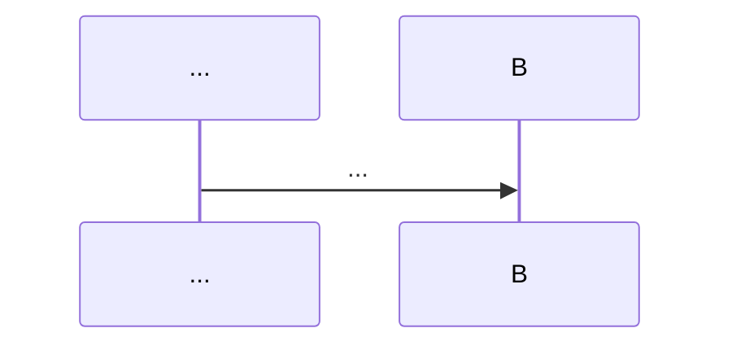
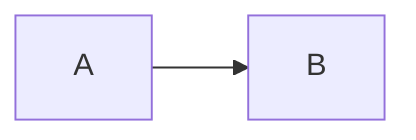

# spec-format — reference contract

The canonical schema for the three on-disk specwright artifacts:
`requirements.md`, `design.md`, and `bugfix.md`. Every downstream skill
(`/specwright:to-prd`, `/specwright:slice`, `/specwright:review`,
`/specwright:bugfix`) reads from or writes to this contract — keep doc and
validator in lockstep.

The executable form of this contract is
[`tests/spec_format_validator.py`](../tests/spec_format_validator.py). When the
two disagree, the validator is authoritative; this document must be updated.

> Storage rationale: see
> [ADR 0001 — Hybrid spec storage](../docs/adr/0001-hybrid-spec-storage.md).
> `requirements.md` and `design.md` (and `bugfix.md` for the bugfix flow) live
> on disk in `.specs/<slug>/`; tasks live in beads. `TASKS.md` mirrors the
> beads slices but is never a source of truth.

---

## 1. Where these files live

```text
.specs/<slug>/
├── requirements.md   # feature + quick flows; also for bugfix flow alongside bugfix.md
├── design.md         # feature + quick flows; bugfix flow if a design change is involved
├── bugfix.md         # bugfix flow only
└── TASKS.md          # auto-generated mirror of beads slices — DO NOT EDIT
```

Tiny flow is an exception: it writes none of the above. Its spec body lives
inside a single beads issue.

---

## 2. EARS notation (used by `requirements.md` and `bugfix.md`)

Acceptance criteria are written in **EARS** — Easy Approach to Requirements
Syntax. Specwright supports **four canonical variants**, and exactly four. The
verb `shall` is mandatory in every variant.

| Variant | Pattern |
| --- | --- |
| Ubiquitous | `The <system> shall <response>.` |
| Event-driven | `When <trigger>, the <system> shall <response>.` |
| State-driven | `While <state>, the <system> shall <response>.` |
| Optional (feature) | `Where <feature>, the <system> shall <response>.` |

### Positive examples

- `The system shall persist every order for at least 30 days.` *(ubiquitous)*
- `When the customer submits a valid order, the system shall return an order id within 200 ms.` *(event-driven)*
- `While the kitchen queue is full, the system shall reject new orders with HTTP 503.` *(state-driven)*
- `Where loyalty points are enabled, the system shall deduct points on order completion.` *(optional)*

### Negative examples (rejected by the validator)

| Bad statement | Why it's rejected |
| --- | --- |
| `When the customer submits a valid order, the system returns an order id within 200 ms.` | Missing the verb `shall`. |
| `If the customer cancels, then the system shall refund the payment.` | `If/then` is **not** one of the four supported variants. Rewrite as `When …` or `While …`. |
| `The customer wants their order back.` | No `shall`, not ubiquitous-shaped. |
| `When X, system shall do Y.` | Trigger clause must be followed by `, the <system> shall …` — `the` is required after the comma. |

> Each acceptance criterion must be a **single sentence** in EARS form,
> written as a markdown list item under the relevant section.

---

## 3. `requirements.md` schema

Required structure:

```markdown
# Requirements: <slug or feature title>

## User Stories

- As a <role>, I want <capability> so that <benefit>.
- ...

## Acceptance Criteria

- The system shall ...
- When <trigger>, the system shall ...
- While <state>, the system shall ...
- Where <feature>, the system shall ...
```

| Element | Required? | Rule |
| --- | --- | --- |
| H1 (`# ...`) | yes | `has_h1` |
| `## User Stories` (or `## User Story`) | yes | `requirements_has_user_stories` |
| `## Acceptance Criteria` (or `## Acceptance Criterion`) | yes | `requirements_has_acceptance_criteria` |
| Each acceptance criterion in EARS | yes | `requirements_acceptance_criteria_use_ears` |
| Any additional sections (e.g. `## Out of Scope`) | optional | — |

Additional rules:

- Acceptance criteria must appear as markdown list items (`-` or `*`), one
  criterion per item.
- The `## User Stories` and `## Acceptance Criteria` sections do not need to
  be in any particular order relative to each other, but both must be present.
- Code-fenced content inside section bodies is preserved verbatim and is
  ignored by structural rules.

---

## 4. `design.md` schema

Required structure:

````markdown
# Design: <slug or feature title>

## Overview

<short prose summary of the architecture>

## Sequence



## Data Flow


````

| Element | Required? | Rule |
| --- | --- | --- |
| H1 (`# ...`) | yes | `has_h1` |
| `## Overview` | yes | `design_has_overview` |
| `## Sequence` (or `## Sequence Diagram`) | yes | `design_has_sequence` |
| `## Data Flow` (or `## Data-Flow`) | yes | `design_has_data_flow` |
| Section order: Overview → Sequence → Data Flow | yes | `design_section_order` |
| Mermaid `sequenceDiagram` block inside `## Sequence` | yes | `design_has_sequence` |
| Mermaid `flowchart` or `graph` block inside `## Data Flow` | yes | `design_has_data_flow` |
| Additional sections after Data Flow (e.g. `## Error Handling`, `## Testing Strategy`) | optional | — |

The three mandatory sections must appear **in order**. Optional sections
(`## Error Handling`, `## Testing Strategy`, `## Open Questions`, etc.) come
after `## Data Flow`.

A mermaid block is recognised as ```` ```mermaid ```` (case-sensitive
language tag) whose first non-blank inner line begins with the required
keyword.

---

## 5. `bugfix.md` schema

Required structure:

```markdown
# Bugfix: <short bug title>

## Current Behavior

<plain prose describing the buggy behaviour reproduced locally>

## Expected Behavior

- When <trigger>, the system shall <response>.
- ...

## Unchanged Behavior

- <behavior that must remain identical after the fix>
- ...
```

| Element | Required? | Rule |
| --- | --- | --- |
| H1 (`# ...`) | yes | `has_h1` |
| `## Current Behavior` (UK spelling `Behaviour` also accepted) | yes | `bugfix_has_current_behavior` |
| `## Expected Behavior` | yes | `bugfix_has_expected_behavior` |
| `## Unchanged Behavior` | yes | `bugfix_has_unchanged_behavior` |
| Each item under `## Expected Behavior` written in EARS | yes | `bugfix_expected_uses_ears` |
| Section order: Current → Expected → Unchanged | yes | `bugfix_section_order` |
| Additional sections (e.g. `## Reproduction`) | optional | — |

Notes:

- `## Current Behavior` is prose, not EARS. Describe the bug as it
  reproduces today.
- `## Expected Behavior` is **the contract for the fix** — every item must be
  a single EARS sentence. The bugfix flow's regression test slice tests these
  ACs.
- `## Unchanged Behavior` lists explicit guarantees the fix must preserve.
  Items may be prose or EARS; the validator does not enforce EARS here.
- UK spellings (`Behaviour`) are accepted everywhere `Behavior` is.

---

## 6. Validator

`tests/spec_format_validator.py` is the executable form of this contract.

```bash
# Self-test against the fixture suite
python tests/spec_format_validator.py

# Validate one or more files; --type forces the artifact type
python tests/spec_format_validator.py path/to/requirements.md
python tests/spec_format_validator.py --type bugfix path/to/some-file.md

# JSON output for downstream tooling
python tests/spec_format_validator.py --json path/to/design.md

# Pytest mode (used in CI)
python -m pytest tests/spec_format_validator.py -v
```

The validator is **stdlib-only** (`re`, `pathlib`, `json`, `sys`,
`argparse`) so it runs in any environment without dependency installation.

### Error format

Every rule failure is reported as:

```
<file>: rule '<rule_name>' failed: <detail>
```

`<rule_name>` is one of the rule identifiers in the tables above. This format
lets CI logs, downstream skills, and reviewers pinpoint exactly which
contract clause was violated.

### Fixtures

`tests/fixtures/spec-format/` holds the canonical test corpus:

```
tests/fixtures/spec-format/
├── requirements/
│   ├── positive/    # >= 3 well-formed examples
│   └── negative/    # >= 3 counter-examples, one rule violation per file
├── design/
│   ├── positive/
│   └── negative/
└── bugfix/
    ├── positive/
    └── negative/
```

Negative fixtures encode the rule they are expected to violate in their
filename (e.g. `missing_user_stories.md` must trip `requirements_has_user_stories`).
This is enforced by `test_negative_fixtures_fail_with_expected_rule` —
a fixture that breaks two rules at once would silently mask one of them, so
each negative fixture is single-issue by construction.

---

## 7. Related contracts

- [ADR 0001 — Hybrid spec storage](../docs/adr/0001-hybrid-spec-storage.md)
- `references/beads-slice-schema.md` *(sibling slice — beads slice metadata)*
- `references/tasks-mirror-format.md` *(sibling slice — TASKS.md format)*
- `references/review-finding-schema.md` *(sibling slice — review JSON shape)*
- `references/verify-commands.md` *(sibling slice — verify command discovery)*

Downstream skills MUST consume this contract verbatim. If a skill needs a
new section or new validation rule, the rule is added here first and to
`tests/spec_format_validator.py` second, with fixtures covering both
acceptance and rejection paths.
