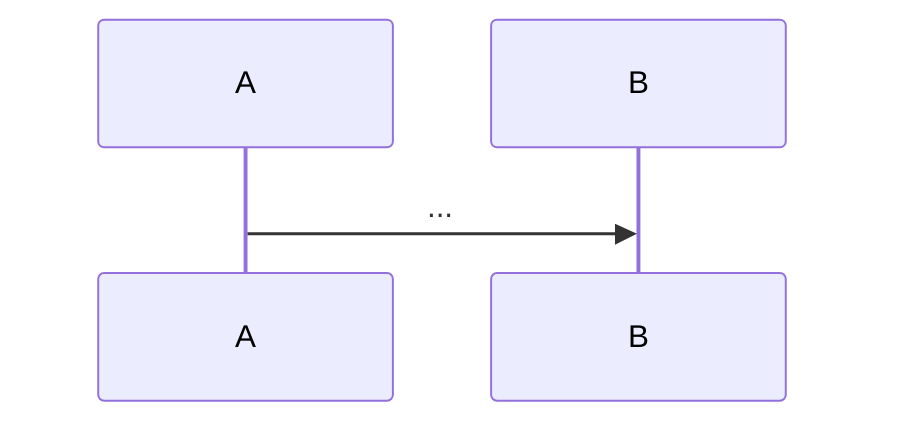

<!-- Adapted from ~/.claude/skills/to-prd -->

This skill takes the current conversation context and codebase understanding and produces specwright PRD artifacts on disk. Do NOT interview the user — synthesize what you already know.

All artifacts must conform to `references/spec-format.md`. Read it before writing anything.

## Determine the flow

Branch on context:

- **Feature or quick flow** → write `requirements.md` + `design.md` in `.specs/<slug>/`.
- **Bugfix flow** → write `bugfix.md` in `.specs/<slug>/`.
- **Tiny flow** → do not use this skill. Tiny flow writes no `.specs/` directory; use the inline beads body format from `references/spec-format.md`.

If the flow is ambiguous, ask the user before writing.

---

## Feature / quick flow

### 1. Explore the codebase

Understand the current state of the codebase if you haven't already. Use the project's domain vocabulary from `CONTEXT.md` throughout all artifacts. Respect any ADRs in the area you're touching.

Sketch the major modules you will need to build or modify. Look for opportunities to extract deep modules — small, stable interfaces with rich implementations that can be tested in isolation.

Check with the user that the module sketch matches their expectations before writing.

### 2. Write `requirements.md`

File path: `.specs/<slug>/requirements.md`

Conform exactly to the template in `references/spec-format.md`:

```markdown
# Requirements: <slug or feature title>

## Assumptions

- [YYYY-MM-DD] Assumed X because Y.

## User Stories

- As a <role>, I want <capability> so that <benefit>.

## Acceptance Criteria

- THE SYSTEM SHALL …
- WHEN <trigger> THE SYSTEM SHALL …
- WHILE <state> THE SYSTEM SHALL …
- WHERE <feature> THE SYSTEM SHALL …
```

Rules:
- Include `## Assumptions` only when invoked from the quick flow. Each item is dated and phrased "Assumed X because Y."
- Omit `## Assumptions` for feature and bugfix flows.
- Each acceptance criterion is a single EARS sentence on its own list item.
- EARS keywords (`WHEN`, `WHILE`, `WHERE`, `THE`, `SHALL`) are **UPPERCASE**. The subject and response are written naturally.
- Write a long, extensive list of user stories covering all aspects of the feature.

### 3. Write `design.md`

File path: `.specs/<slug>/design.md`

Conform exactly to the template in `references/spec-format.md`:

````markdown
# Design: <slug or feature title>

## Overview

<short prose summary of the architecture>

## Sequence



## Data Flow


## Error Handling

<how the system surfaces and recovers from failures>

## Testing Strategy

<intent-based test approach per layer>
````

Rules:
- `## Overview`, `## Sequence`, and `## Data Flow` are required and must appear in that order.
- `## Sequence` must contain a fenced `mermaid` block starting with `sequenceDiagram`.
- `## Data Flow` must contain a fenced `mermaid` block starting with `flowchart` or `graph`.
- `## Error Handling` and `## Testing Strategy` are optional; follow `## Data Flow` in any order.
- Do NOT include specific file paths or code snippets in prose sections — they go stale. Exception: a prototype snippet that encodes a decision more precisely than prose can (state machine, schema, type shape); trim to the decision-rich part and note it came from a prototype.

### 4. Publish to beads

Create the epic in beads:

```bash
bd create --title "<feature title>" --body "..."
```

Apply the `ready-for-agent` label to the epic.

---

## Bugfix flow

### 1. Reproduce first

Do not write anything until the bug is reproduced locally. If reproduction fails, bail and tell the user what you tried.

### 2. Write `bugfix.md`

File path: `.specs/<slug>/bugfix.md`

Conform exactly to the template in `references/spec-format.md`:

```markdown
# Bugfix: <short bug title>

## Current Behavior

<prose describing the bug as reproduced locally>

## Expected Behavior

- WHEN <trigger> THE SYSTEM SHALL <response>.

## Unchanged Behavior

- <behavior the fix must not affect>
```

Rules:
- Sections must appear in the order: Current → Expected → Unchanged.
- `## Current Behavior` is plain prose — not EARS. Describe the bug as it reproduces today.
- `## Expected Behavior` items must each be a single EARS sentence. These become the ACs for the regression test slice.
- `## Unchanged Behavior` items may be prose or EARS.
- UK spelling (`Behaviour`) is accepted.

### 3. Mandatory 2-slice split

After `bugfix.md` is written, immediately prepare the two-slice split for `/specwright:to-issues`:

- **Slice 1:** Failing regression test (RED only — no fix code). AC: the `## Expected Behavior` EARS sentence(s).
- **Slice 2:** Fix + green + Unchanged still green. `depends_on: [slice-1-id]`.

Tell the user the 2-slice structure is ready and to run `/specwright:to-issues` to publish both slices.
