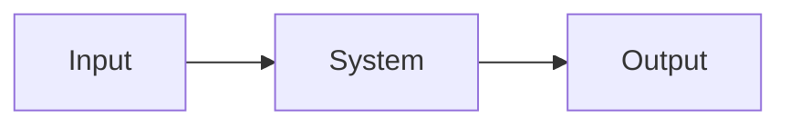

# specwright:to-prd

Convert existing conversation context, grill output, and codebase understanding into specwright PRD artifacts. Do not conduct a fresh interview unless required information is missing and cannot be inferred safely.

The output contract is [references/spec-format.md](../../references/spec-format.md).

## Inputs

- Flow: `feature`, `quick`, or `bugfix`.
- Slug: usually the beads epic ID.
- Resolved intent and user stories.
- EARS candidate acceptance criteria.
- Relevant glossary terms from `CONTEXT.md`.
- Relevant ADRs and code constraints.

## Workflow

1. Explore the repo enough to understand current behavior, integration points, and naming.
2. Use glossary vocabulary from `CONTEXT.md`.
3. Write artifacts under `.specs/<slug>/`.
4. For quick flow, add `## Assumptions` at the top of `requirements.md`; each item must be dated `[YYYY-MM-DD] Assumed X because Y.`
5. For feature and bugfix flows, omit `## Assumptions`.
6. Write every acceptance criterion as a single markdown list item in EARS notation:
   - `THE <SYSTEM> SHALL <RESPONSE>`
   - `WHEN <TRIGGER> THE <SYSTEM> SHALL <RESPONSE>`
   - `WHILE <STATE> THE <SYSTEM> SHALL <RESPONSE>`
   - `WHERE <FEATURE> THE <SYSTEM> SHALL <RESPONSE>`
7. Write `design.md` with `## Overview`, `## Sequence`, and `## Data Flow` in that order.
8. Include a `sequenceDiagram` mermaid block and a `flowchart` or `graph` mermaid block.
9. For bugfix flow, also write `bugfix.md` with `## Current Behavior`, `## Expected Behavior`, and `## Unchanged Behavior` in that order.

## Artifact Templates

`requirements.md`:

```markdown
# Requirements: <title>

## User Stories

- As a <role>, I want <capability> so that <benefit>.

## Acceptance Criteria

- WHEN <trigger> THE SYSTEM SHALL <observable response>.
```

`design.md`:

````markdown
# Design: <title>

## Overview

<short architecture summary>

## Sequence

```mermaid
sequenceDiagram
    Actor->>System: action
    System-->>Actor: observable result
```

## Data Flow



## Error Handling

<failure behavior>

## Testing Strategy

<intent-based tests mapped to ACs>
````

`bugfix.md`:

```markdown
# Bugfix: <title>

## Current Behavior

<locally reproduced bug>

## Expected Behavior

- WHEN <trigger> THE SYSTEM SHALL <response>.

## Unchanged Behavior

- <behavior the fix must preserve>
```

## Validation Before Returning

- `requirements.md` has required sections from `spec-format.md`.
- `design.md` has ordered overview, sequence, and data-flow sections with mermaid blocks.
- `bugfix.md`, when present, has the required three behavior sections.
- EARS keywords are uppercase.

Return the written paths and any unresolved assumptions.
