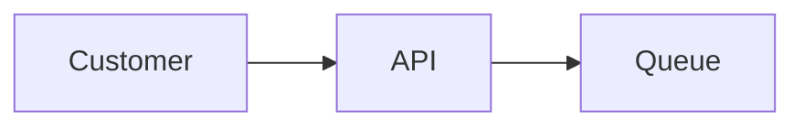

# Design: Coffee Order API

## Overview

This document describes the architecture of the Coffee Order API service.

## Sequence

The customer POSTs to /orders. The API enqueues, then responds 201.

## Data Flow

