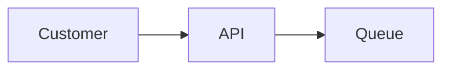
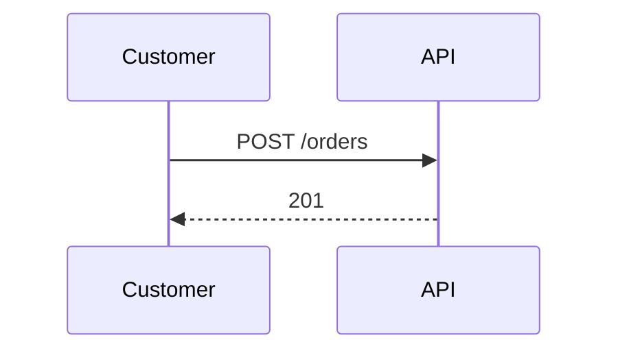

# Design: Coffee Order API

## Data Flow

```mermaid
flowchart LR
    Customer --> API
    API --> Queue
```

## Overview

This document describes the architecture of the Coffee Order API service.

## Sequence

```mermaid
sequenceDiagram
    participant C as Customer
    participant A as API
    C->>A: POST /orders
    A-->>C: 201
```
