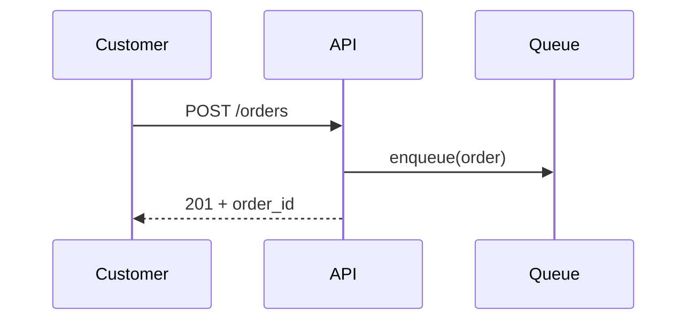
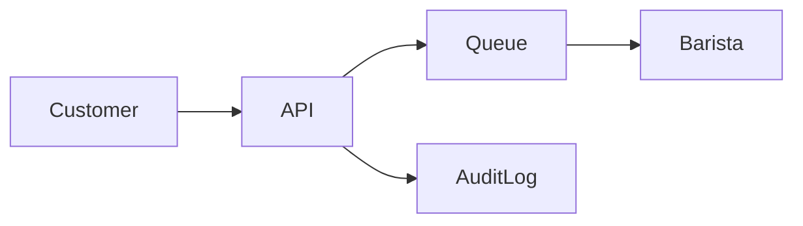

# Design: Coffee Order API

## Overview

This document describes the architecture of the Coffee Order API service. It accepts orders from customers, queues them for baristas, and persists each order for audit.

## Sequence

## Data Flow

