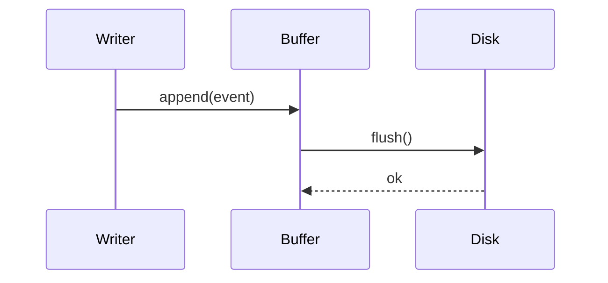
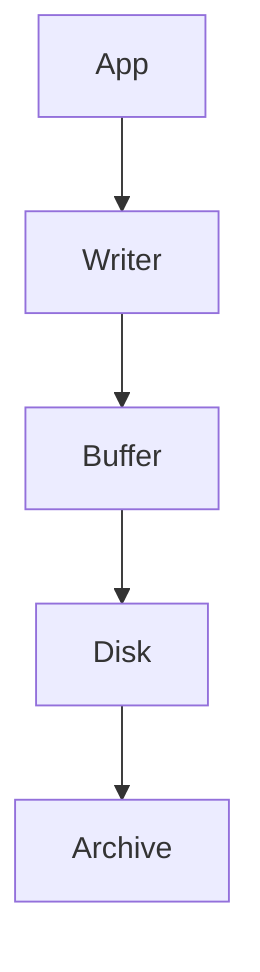

# Design: Audit Logging

## Overview

The audit logger writes every state mutation to an append-only log. It runs in-process and buffers when the disk writer is unavailable.

## Sequence

## Data Flow

## Error Handling

When the disk writer is unavailable, events spill into the in-memory buffer up to 10 000 entries.

## Testing Strategy

Integration tests exercise the buffer fill / spill / flush cycle end to end.
