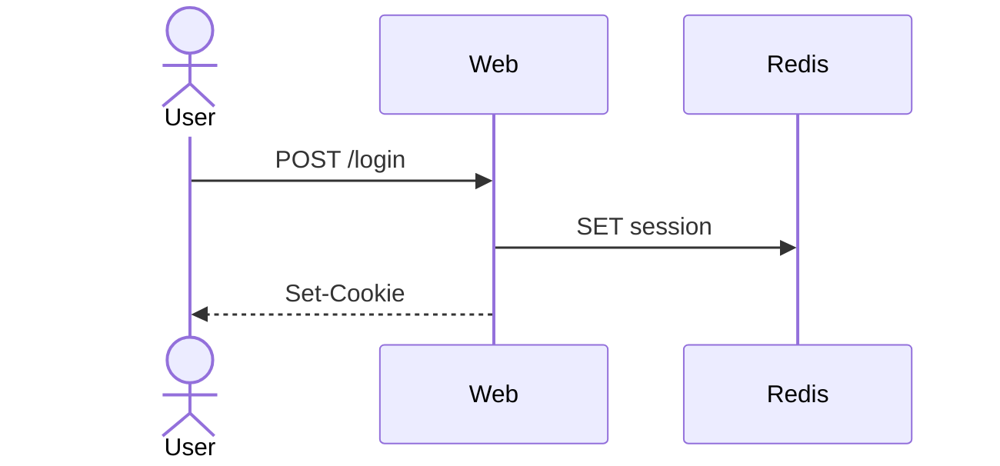
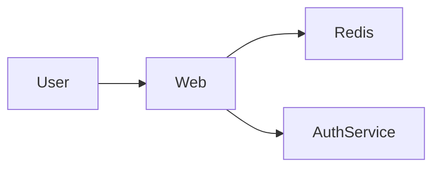

# Design: Login Flow

## Overview

Session-based authentication for the web app. Tokens live in HTTP-only cookies; sessions persist in Redis with a TTL.

## Sequence

```mermaid
sequenceDiagram
    actor U as User
    participant W as Web
    participant R as Redis
    U->>W: POST /login
    W->>R: SET session
    W-->>U: Set-Cookie
```

## Data Flow

```mermaid
graph LR
    User --> Web
    Web --> Redis
    Web --> AuthService
```
